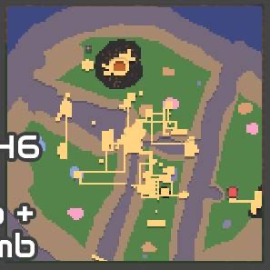
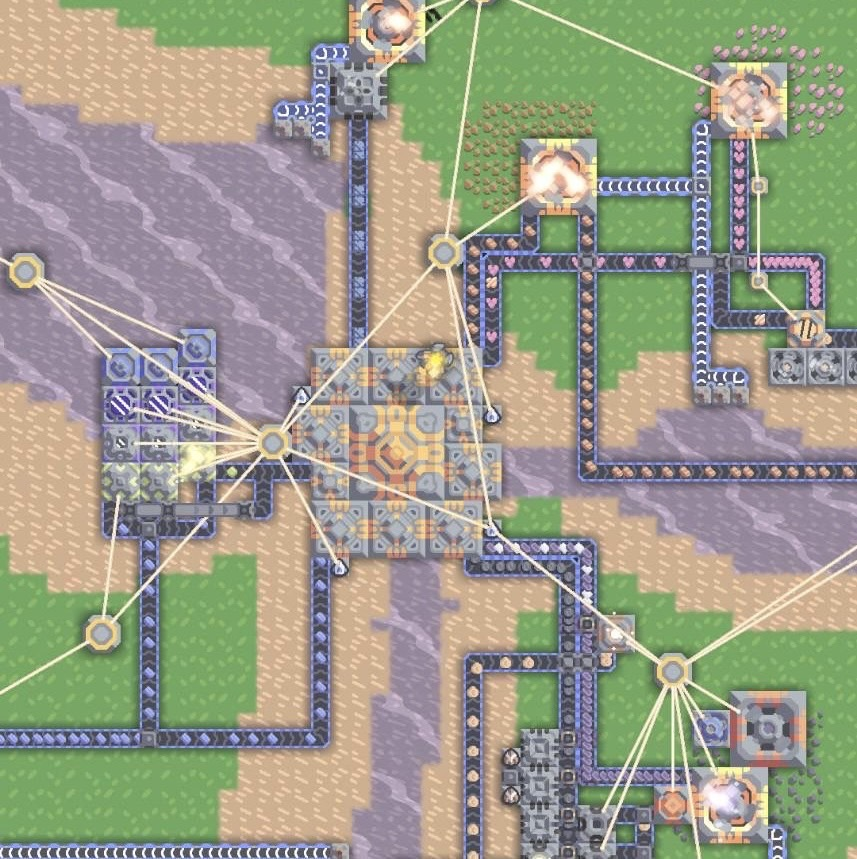

# what is mindusty

mindusty is RTS(real time strategy) game based on defending or attacking enemy core while gathering resource build factory turret and unit

# map information

mindusty map is user-created map

## map 1 : center point

this map feature multiple core in plain area, enemy have multiple drop point coming from all side

## map 2 : defend the island

this map feature singular core on medium sized island

the starter building contain well-built storage resource gathering and basic defense sythem

the enemy on this map will be 20 waves of very intense fast paced navalxarial assualt from all side with each wave only have interval of 60 second

special feature. 

-player tail and speed boost,player unit will receive a tail and the slight attack/move speed boost
