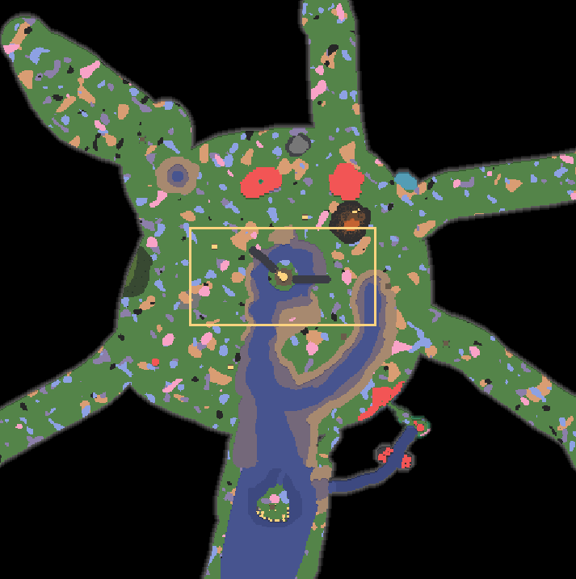
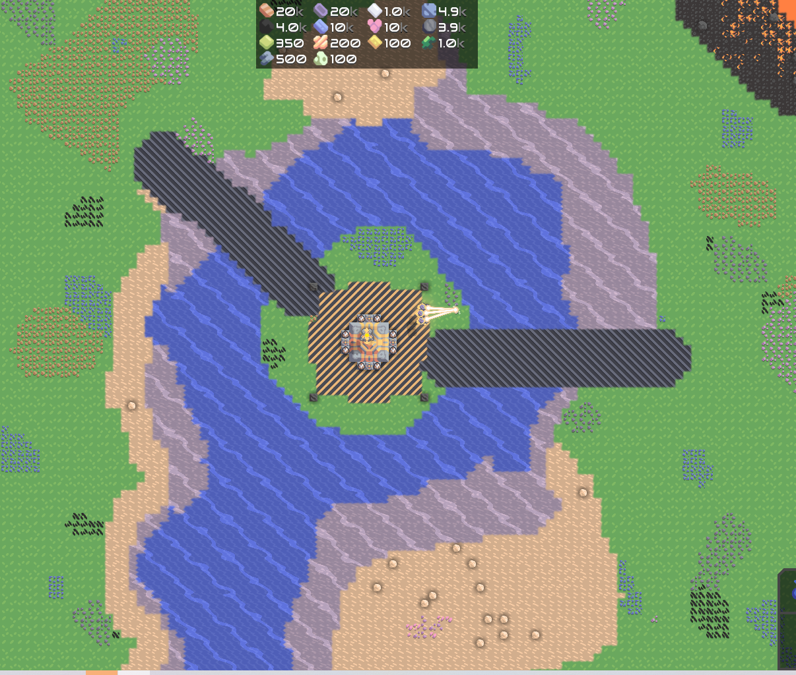
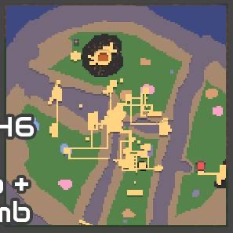

# what is mindusty

mindusty is RTS(real time strategy) game based on defending or attacking enemy core while gathering resource build factory turret and unit.

# map information

mindusty map is user-created map, is stored in `.msav` format.

## map 1 : center point

this map feature multiple core in plain area, enemy have multiple droppoint and coming from all side with one side as a river for naval attack.  

the main core stationed in the middle of the map,int the main core can build up to 8 extra core, assistance unit spawned on the main core.

special feature. 

- player tail and speed boost,player unit will receive a tail and the slight attack/move speed boost
- modified mono:mono now attack with rainbow blasting ability , it still have low health but blasted tier 5 away within seconds , not only that when destroyed releases self-destruction green blast, the range is low so you better prepare multiple air defense before it appeared
- assistance unit,after set amount of time assistance unit is spawned to help the player,consist of mono which spawn almost immediatly and poly later on. the unit is specially marked with permanant buff to help them work better

`beatable confirmed`

## map 2 : defend the island

this map feature singular core on medium sized island

the starter building contain well-built storage resource-gathering energy-producing and basic-defense sythem

the enemy on this map will be 20 waves of very intense fast paced navalxarial assualt from all side with each wave only have interval of 60 second

special feature. 

- player tail and speed boost,player unit will receive a tail and the slight attack/move speed boost

`beatable confirmed`

## map 3 : attack the HQ

this is attack map

the map feature singular core, multiple enemy base that needed all type of unit for an attack the main base is shielded by completely unbreakable shield, the way to turn it off is to shut down every of its energy source

`beatable confirmed`

## map 4 : infinite defend map

the map feature multiple core and droppoint but singular walk path, enemy only consist of ground unit, player is gifted with infinite amount of resource , however each turret have maximum placement unit building is banned and the map is the most enemy intensive map ever, how long could you defend this. 

special feature.  

- infinite resource
- limited turret

`beatable unconfirmed`

## map 5 : infinite attack map

    this map feature the 

